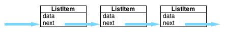

# Collecting Collections

## Abstract Data Types (ADTs), FWIW

An abstract data type (or ADT) is an abstract representation of a data structure. ADTs allow us to talk about data structures independent of their implementation.

Ruby Arrays, Hashes and other data types that we build on our own (like linked lists), are often used to implement our ADTs. We'll see examples of this when we look at stacks and queues.

In Ruby the Array class if very powerful, it encapsulates many ideas within computer science. In a more fundamental programming language many of the functions of an Array would not be built in, but instead the programmer would have to implement them. In this lecture we'll talk about a few kinds of collections.

## Linked Lists

 Linked lists are a computer science data structure which is used to keep a list of items that are sequential.

Linked lists are made up of single nodes which can be strung together to form a unidirectional
list:



Let's code through making a linked list class in Ruby.

## Stacks and Queues

Stacks and Queues are simple collections which only support the removal of a single item at a time.

A stack is easiest to imagine as figurative stack of paper where you only have access to the top sheet. In order to add a paper to the collection, you place it on top of the stack. At any given time, you can only access the last paper that you place on the stack by pulling it off.

Stacks maintain what is called a "Last In First Out" or LIFO ordering on the collection.

The Stack ADT is defined as supporting two operations: ```push``` which adds something to the top of the stack and ```pop``` which "pops" the last item off the top of the stack.

You're probably already familiar with these operations–they're built into Ruby's Arrays!

### Bronze

Implement a Stack class that uses a Ruby Array as its backing store. Be careful not to expose all the methods of the Array in your class! Users of your class should only have access to the ```push``` and ```pop``` methods *of your class* and not have direct access to the underlying array.

### Silver

Implement a Stack class that uses a linked list as its underlying backing store. As above, you should only expose users of your class to the ```push``` and ```pop``` methods, and not expose the underlying linked list.

## Queues

A queue is a collection that is very similar to a stack except that it reverses the order of access to the underlying items in the collection. That is, a queue maintains what is called a "First In, First Out" or FIFO ordering.

Queues are like lines at the deli counter: the first person in line gets served first, and any new additions to the line go to the end.

The Queue ADT supports two operations (again, one to add members and one to retrieve members) called ```enqueue``` and ```dequeue```.

```enqueue``` adds items to the end of the line, and ```dequeue``` removes the first item in line from the queue.

### Bronze

Implement a Queue class that uses a Ruby Array as its backing store. Be careful not to expose all the methods of the Array in your class! Users of your class should only have access to the ```enqueue``` and ```dequeue``` methods of your class and not have direct access to the underlying array.

### Silver

Implement a Queue class that uses a linked list as its underlying backing store. As above, you should only expose users of your class to the ```enqueue``` and ```dequeue``` methods, and not expose the underlying linked list.
