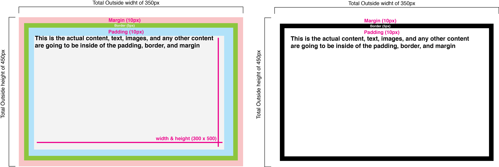

# CSS

### (Work in progress)

CSS (Cascading Style Sheet) exists to style your HTML for web, print, and more!

We use CSS to add layout and design to our page. We can also use CSS to share styles across websites and pages.

- There are a lot of CSS properties
- We will not get anywhere close to
covering all of them
- Practice the basics before getting fancy

## Anatomy of CSS

`selector { property: value; }`

- Selector is the thing you want to style
- Property is what aspect you want to style
- Value is how you want to style it
- Property + value = declaration
- Declarations end in semicolons (;)

## Selectors

CSS selectors is the syntax used to specify which HTML elements to apply a declaration to. For example, in css any tag is a valid selector,

```css
p {
  color: red;
}
```
but there are also methods of selecting ids, classes, and even states such as hover.

The prefered way of selecting elements is using the class selector. Class selectors begin with a `.` followed by the class name to select:

```css
.bordered {
  border: 1px solid black;
}

.main {
  font-size: 14px;
}

.sidebar {
  background-color: #6d89ee;
}
```

selecting by ids is similar, but instead the selector begins with a `#` (don't select by id).

## Common

**Font Properties**

- font-size: a number followed by a measurement of how tall the element's text is, usually in ems (em) or pixels (px)
- font-family: the name of a typeface, or typefaces
- font-style: italic
- font-weight: bold | values of bold!
- line-height: a number followed by a
measurement of how tall the element's line of is,
usually in ems (em) or pixels (px)

**Text Properties**

- text-align: left | right | center | justify
- text-transform: capitalize | uppercase | lowercase | some others
- text-decoration: underline | overline | line-through | some others
- Note: A lot of properties will take a value of none

**Colors**

- To set text colors, the property is color
- To set background colors, the property is background-color
- The value can be done a few ways:
  - Hex: #ff0000
  - RGB: rgb(255,0,0)
  - Also possible but not preferred: red


## Cascading

The C in CSS stands for cascading, what does that mean? Any given element might have several conflicting rules defined for it. Instead of overriding each other, they "cascade", then the most important definition is chosen. For example
```html
<p class='main'>
  This is the main text
</p>
```

```css
p {
  color: red;
  font-size: 12px;
}

.main {
  font-size: 14px;
}
```

In this scenario, the text within the `<p>` has two conflicting styles for `font-size`, instead of one overriding the other permantely, they are both valid, but since `.main` is more specific than `p`, it is considered more important. A general rule is the more specific a selector is, the higher the importance in the final selection.

## Box Model

In CSS every HTML element can be thought of as a box. Boxes have 4 major components:

1. Margin
1. Border
1. Padding
1. Content (width and height)

All four of these components contribute to the total dimensions of the box.




## Including CSS in an HTML page

Browsers can be instructed to download additional files after the HTML page has been downloaded, `link` tags in the `head` element can accomplish this


```html
<head>
  <link rel="stylesheet" href="css/main.css" media="screen">
</head>
```


## Combining Selectors

Selectors can be combined to make a selection more specific. There are two primary ways to group selectors:

- Selectors attached together mean that the element has both of the selectors
```
.header.navigation
```
- Spaces between selectors indicate children.
```
.header .navigation
```

## Float

The float property in CSS takes an element out of the the normal flow, and moves it to the left or right wall of it's containing element.

This can be quite powerful but have some unexpected results. The biggest unexpected result, is that the height of a floated element is not taken into account by surrounding elements.

- A large list of [common CSS properties here](https://developer.mozilla.org/en-US/docs/Web/CSS/CSS_Properties_Reference)
- [CSS Box Model](https://developer.mozilla.org/en-US/docs/Web/CSS/CSS_Box_Model/Introduction_to_the_CSS_box_model)

## More Resources
- [Hex and RGB Colors](http://www.w3schools.com/tags/ref_colorpicker.asp)
- [Hex Colors](http://0to255.com)

- [Pseudo Classes](http://htmldog.com/guides/css/intermediate/pseudoclasses/)
- [HTML Validator](http://html5.validator.nu)
- [CSS Validator](http://jigsaw.w3.org/css-validator)
