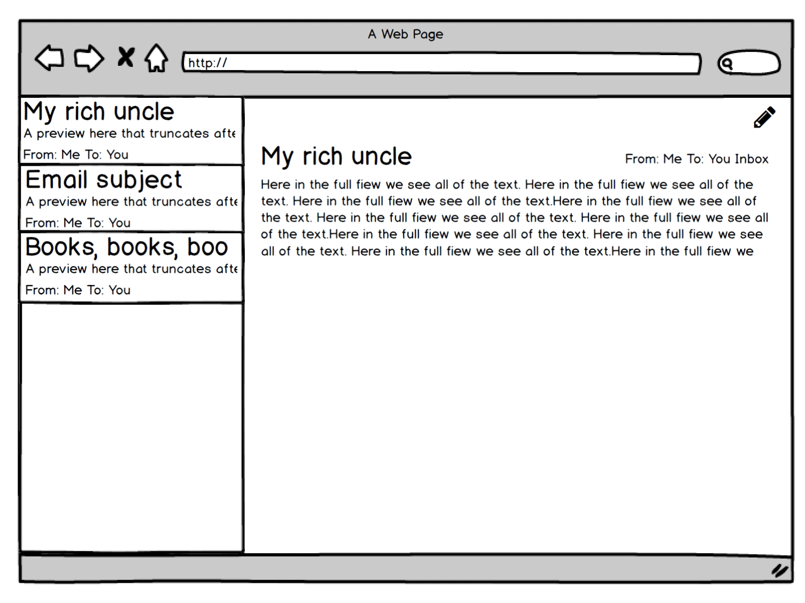

# React 102

In this portion we'll extend our simple email Hello World to create components using functions, state, and props, to actually make an app.

First, let's look at the structure of what we want to create.



Now, let's start by building out the sidebar:

```js
'use strict';

var React = require('react');
var ReactDOM = require('react-dom');

var emails = [
  {subject: "My rich uncle", body: "Lorem ipsum", to: "You", from: "Me"},
  {subject: "Hello There", body: "Riker ipsum", to: "Riker", from: "Picard"},
  {subject: "Buy, buy,buy", body: "Buy something", to: "You", from: "Congo"}
]

var Email = React.createClass({
  getInitialState: function() {
    return {emails: emails};
  },
  render: function() {
    return <EmailSidebar emails={this.emails} />;
  }
});

var EmailSidebar = React.createClass({
  render: function() {
    return(
      <div>
        TEST
      </div>
    )
  }
})

ReactDOM.render(<Email />, document.getElementById('email'))
```

Here we've done two things, we've added an `EmailSidebar` class and changed the `Email` class to render the `EmailSidebar` class, we do this by essentially treating it like an HTML element `<EmailSidebar />`. We can mix this syntax of React components with actual HTML elements. The attributes we set when adding a react component to the rendered HTML act like named arguments `<EmailSidebar emails={this.emails} />` which will be passed through to use in the class, these named arguments are called `props`. So in the definition of the `EmailSidebar` class we can use `this.props.emails` to access the values passed through at `<EmailSidebar emails={this.emails} />`.

```js
var EmailSidebar = React.createClass({
  render: function() {
    var rows = [], i;
    for (i = 0; i < this.props.emails.length; i++) {
      rows.push(<div>{this.props.emails[i].subject}</div>);
    }
    return(
      <div className='email-list'>
        {rows}
      </div>
    )
  }
});
```

This will allow us to iterate through the `emails` and create a `div` for each one, displaying the subject. We will take this nesting one step further by creating a `EmailListItem` class which will be the component for each individual email. This is where we can register actions like show and delete.

```js
'use strict';

var React = require('react');
var ReactDOM = require('react-dom');

var emails = [
  {subject: "My rich uncle", body: "Lorem ipsum", to: "You", from: "Me"},
  {subject: "Hello There", body: "Riker ipsum", to: "Riker", from: "Picard"},
  {subject: "Buy, buy,buy", body: "Buy something", to: "You", from: "Congo"}
]

var Email = React.createClass({
  getInitialState: function() {
    return {emails: emails};
  },
  render: function() {
    return <EmailSidebar emails={this.state.emails} />;
  }
});

var EmailSidebar = React.createClass({
  render: function() {
    var rows = [], i;
    for (i = 0; i < this.props.emails.length; i++) {
      rows.push(<EmailListItem key={i} email={this.props.emails[i]} />);
    }
    return(
      <div className='email-list'>
        {rows}
      </div>
    )
  }
});

var EmailListItem = React.createClass({
  render: function () {
    return(
      <div className="email-list-item">
        <small>
          From: {this.props.email.from}
          To: {this.props.email.to	}
        </small>
        <h3>{this.props.email.subject}</h3>
        <h4>{this.props.email.body.substring(0,20)}</h4>
      </div>
    )
  }
});

ReactDOM.render(<Email />, document.getElementById('email'))
```
