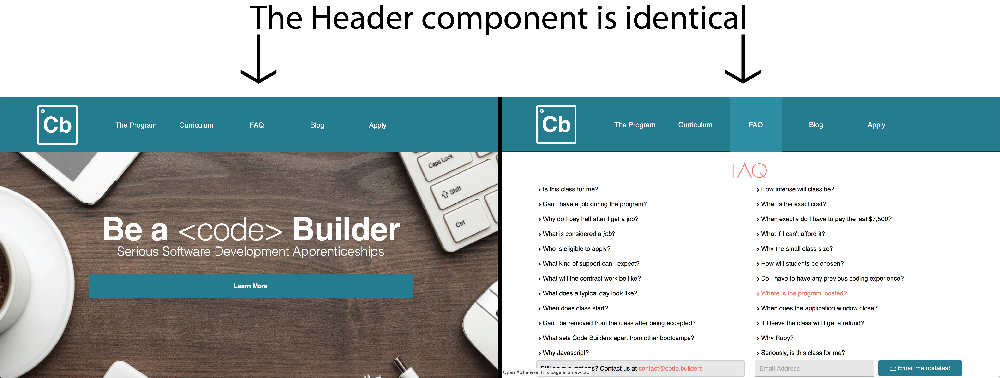
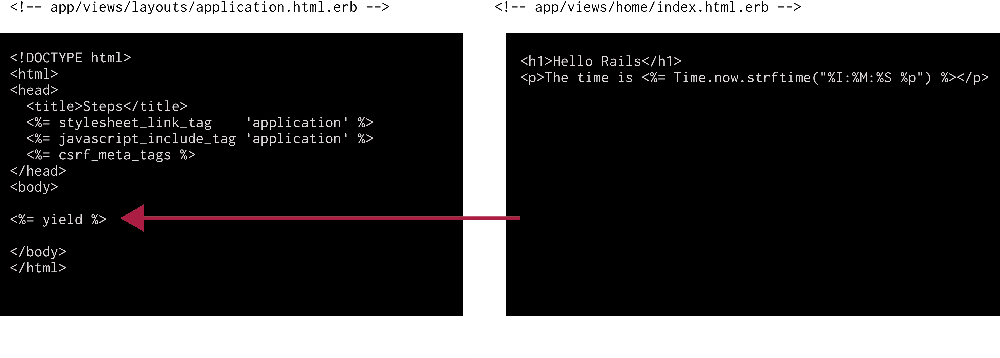

# Application Layout

In Rails the application layout saves a lot of work and sanity. The basic idea is that everypage of a website have duplicate code, like the header, footer, the CSS `<link>` tags, and more, instead of putting this is every page we can just put it in a single page, then Rails will use Ruby to interpolate every other page into the layout file.



When creating a new rails app the layout file is created for us in the file `app/views/layouts/application.html.erb` which looks like:

```html
<!DOCTYPE html>
<html>
<head>
  <title>Steps</title>
  <%= stylesheet_link_tag    'application', media: 'all', 'data-turbolinks-track' => true %>
  <%= javascript_include_tag 'application', 'data-turbolinks-track' => true %>
  <%= csrf_meta_tags %>
</head>
<body>

<%= yield %>

</body>
</html>
```

We can modify this file to our hearts content, the only bit of the file that is sacred is `<%= yield %>`. This is where each individual HTML file will be embedded.


