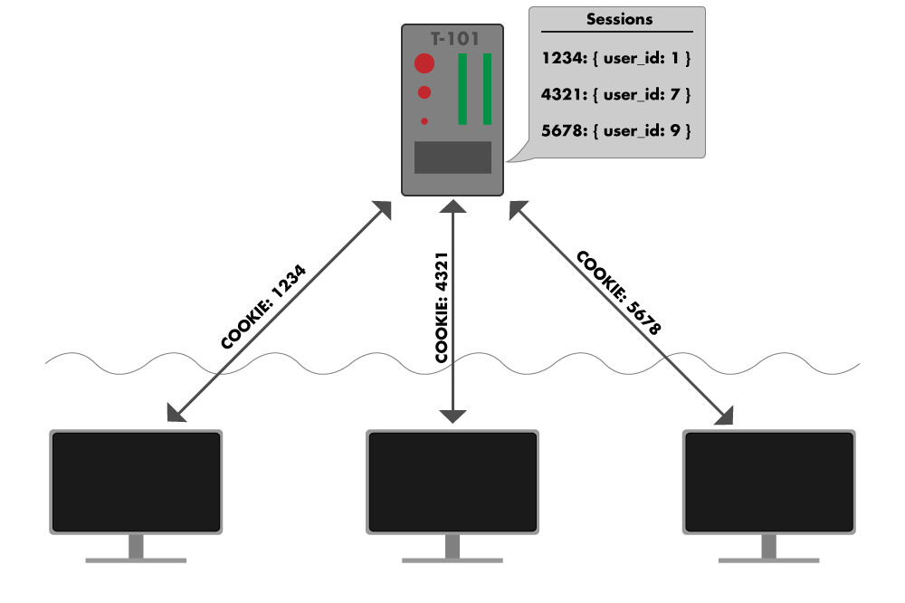

# Session

The session is a hash like object (similar to params), but this object is persisted between requests.
Sessions use a "cookie" to store a unique id in the browser, when a browser makes any request it sends along the cookie information. A web application can use this unique id to keep track of each unique browser which has made requests to it. The default rails session is meant to store small amounts of data (4kB or less).

The most common use is to store the id of a logged in user. The session, similar to params, is also a method on the controller which gives us access to a hash.



From within a controller we can get and set session keys using the familiar hash syntax.


In logged in user example, a user id key would be set in the session hash, then on each subsequent request the user id would be used from the session has to find the "current user".

```ruby
class UsersController < ApplicationController

  def create
    @user = User.new
    if @user.save
      session[:user_id] = @user.id
      redirect_to root_path
    end
  end

  def show
    @user = User.find(session[:user_id])
  end
end
```
