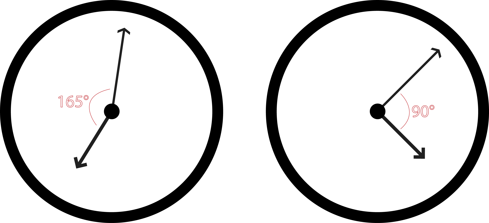

## Clock

Write a method which calculates the angle between the hour hand and minute hand of a clock for any given time:



The method should take two arguments, the hour and the minutes and return an integer which is the angle between the hands:

```rb
angle_of_hands(1,20)
# => 90
```

The result should always be the smallest angle (i.e. less than 180)
